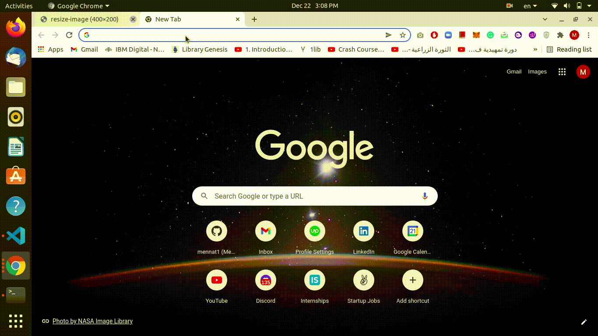

An API that can be used in two different ways:
- As a simple placeholder API, allowing you to place images into your frontend with the size set via URL parameters. 
- As a library to serve properly scaled versions of your images to the front end to reduce page load size. Rather than needing to resize and upload multiple copies of the same image to be used throughout your site, the API you create will handle resizing and serving stored images for you.

Instructions:
- npm install
- place your image in the images folder
- npm run start
- http://localhost:3000/image-processing-api/resize-image?filename=your_image_name&height=200&width=200
- Or resize an existing image: http://localhost:3000/image-processing-api/resize-image?filename=img3&height=200&width=200

Available sripts:
- "start": "nodemon --watch './**/*.ts' --exec 'ts-node' ./src/index.ts"
- "build": "npx tsc"
- "start:prod": "npm run build && node dist/index.js"
- "lint": "eslint . --ext .ts"
- "lint:fix": "eslint . --ext .ts --fix"
- "format": "prettier --write 'src/**/*.ts'"
- "test": "npx tsc && jasmine"